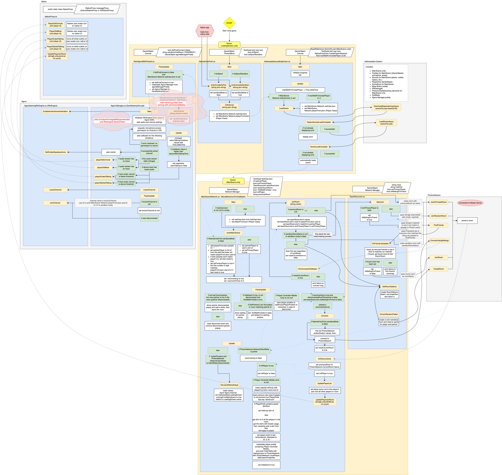

# Aaron's Coding Samples
This repository showcases a selection of code excerpts for Unity3D. Due to restrictions on sharing recent work publicly, these samples highlight specific pieces of code I’ve written from various projects over the years. All the code was written without / before Cursor AI usage. Please refer to this README file for a detailed description and overview.

이 저장소에는 유니티용 코드 발췌 모음이 포함되어 있습니다. 최근 작업을 공개적으로 공유할 수 없는 제한 사항으로 인해, 여기에는 제가 작성한 특정 코드 샘플만 포함되어 있습니다. 모든 코드는 Cursor AI를 사용하지 않고 작성되었습니다. 자세한 설명과 개요는 이 README 파일을 참고하세요.
 
### Table of contents
 
1. [Code 1 : Scene Manager](#code-1--scene-manager-link)
2. [Code 2 : Photon Volley Ball](#code-2--photon-volley-ball-link)
3. [Code 3 : Photon Main Network](#code-3--photon-main-network-link)
4. [Code 4 : Agora Manager](#code-4--agora-manager-link)
4. [Code 5 : Boid Demo](#code-5--boid-demo-link)

### Code 1 : Scene Manager [(link)](Code1-SceneManager)

#### From 2023

The SceneManager class handles the loading and unloading of Scenes.

SceneManager 클래스는 씬의 로딩 및 언로딩을 관리합니다.

### Code 2 : Photon Volley Ball [(link)](Code2-PhotonVolleyBall)

#### From 2021

This Volleyball class manages the behavior of an interactive volleyball in a 2D game. It is synchronized across players using the **Photon Networking SDK**.

이 Volleyball 클래스는 2D 게임에서 상호작용할 수 있는 배구공의 동작을 관리합니다. **Photon Networking SDK**를 사용하여 플레이어 간 동기화됩니다.

### Code 3 : Photon Main Network [(link)](Code3-PhotonMainNetwork)

#### From 2021

The MainSceneNetwork class handles player connectivity for the **Photon Networking SDK**, including initial connection, reconnection, and joining a room. Each Photon room is designed for paired gameplay, where players enter with a partner player.

Additionally, the **AppLoadingDiagram_drawio.png** file is a diagram I created using draw.io to illustrate the app's loading sequence and network joining behavior.

🇰🇷 한국어

MainSceneNetwork 클래스는 Photon Networking SDK를 활용한 플레이어 연결을 처리하며, 초기 연결, 재접속, 그리고 룸 참가 기능을 담당합니다. 각 Photon 룸은 파트너 플레이어와 함께하는 멀티플레이를 위해 설계되었습니다.  또한, AppLoadingDiagram_drawio.png 파일은 앱의 로딩 과정 및 네트워크 접속 흐름을 시각화하기 위해 draw.io를 사용하여 제작한 다이어그램입니다.

### Code 4 : Agora Manager [(link)](Code4-AgoraManager)

#### From 2021

A basic implementation of the **Agora SDK** for enabling real-time chat functionalities in an iOS/Android mobile game.

iOS/Android 모바일 게임에서 실시간 채팅 기능을 구현하기 위한 **Agora SDK**의 기본적인 적용 사례입니다.

### Code 5 : Boid Demo [(link)](Code5-BoidDemo)

#### From 2020

This is a **Boid (bird-oid objects) simulation** featuring 2D rockets. Using ControlSlider instances, you can dynamically adjust and observe Boid behavior in real time, including Alignment, Cohesion, and Separation.

이것은 **Boid (bird-oid objects)** 시뮬레이션으로, 2D 로켓을 활용한 군집 행동을 구현한 데모입니다. ControlSlider 인스턴스를 사용하여 Alignment(정렬), Cohesion(응집), Separation(분리) 등의 Boid 행동을 실시간으로 조정하고 관찰할 수 있습니다.